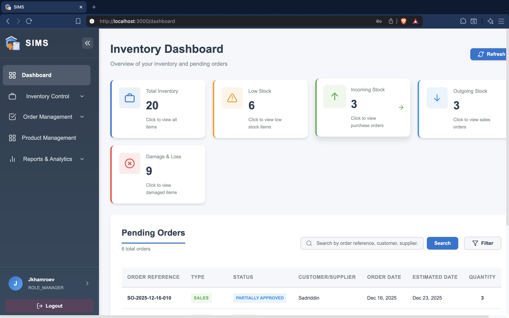
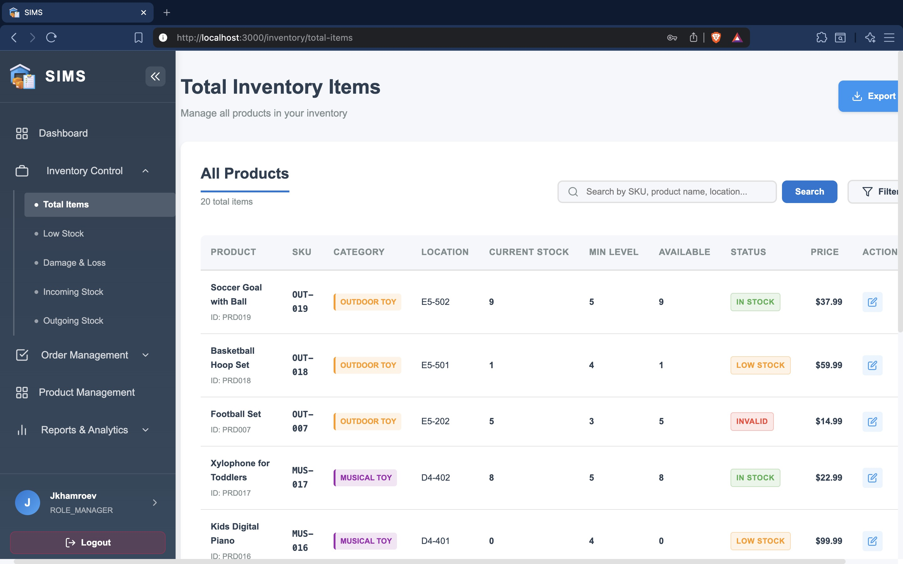
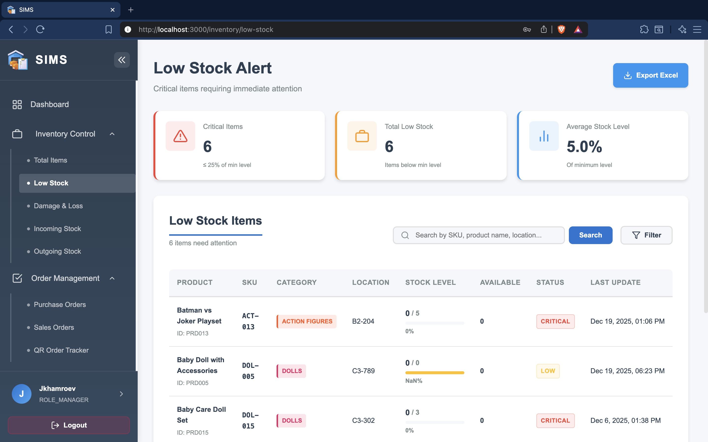
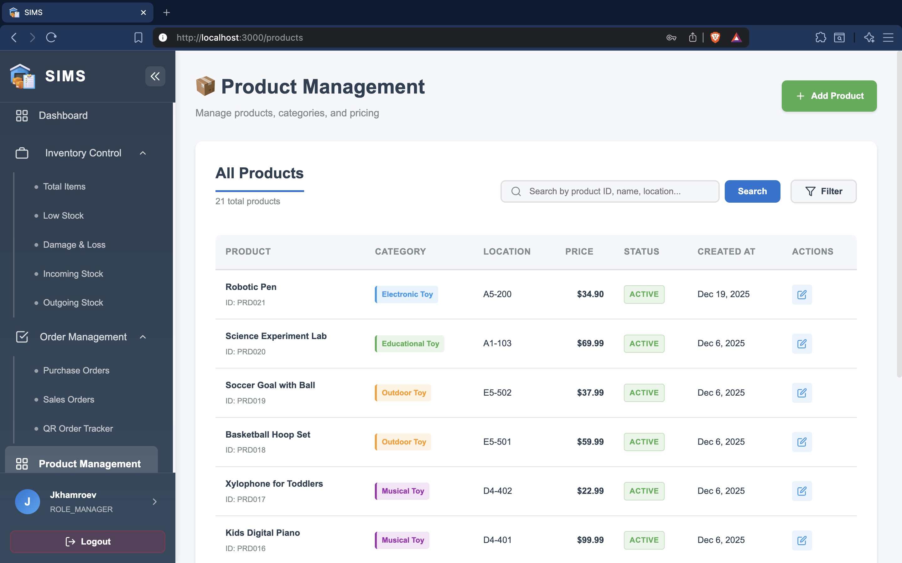
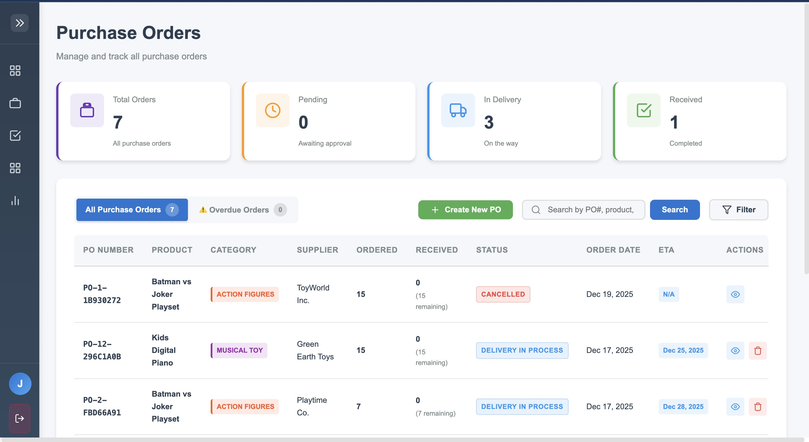
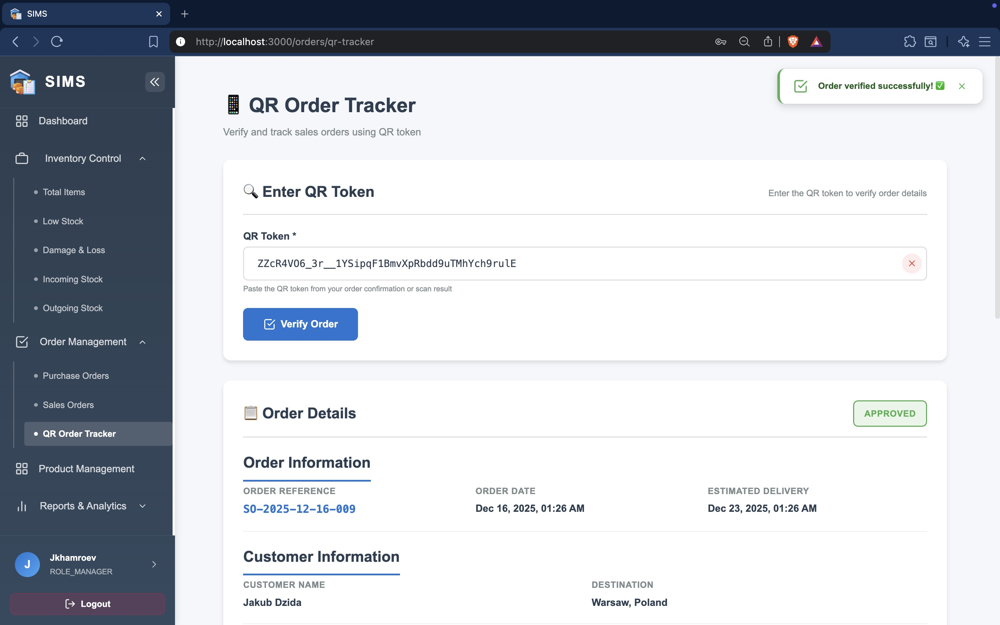
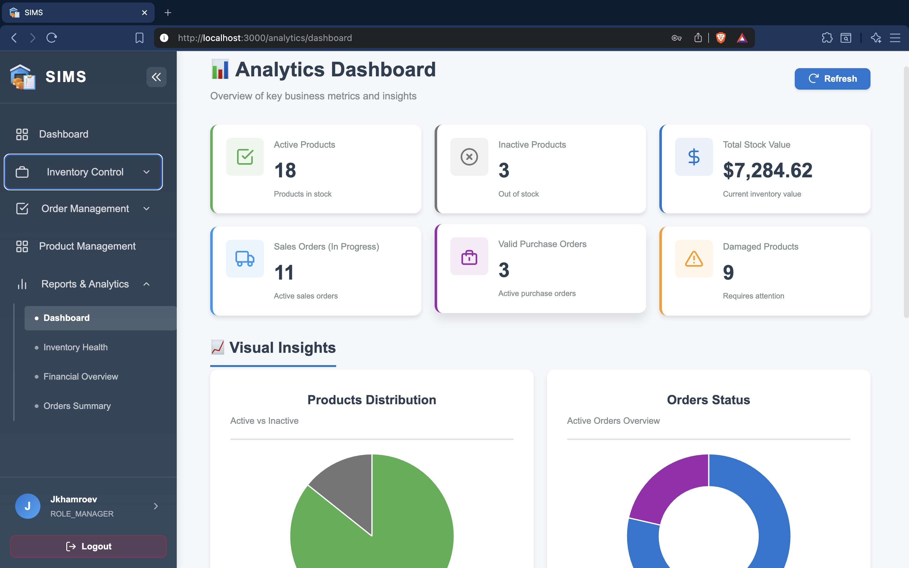
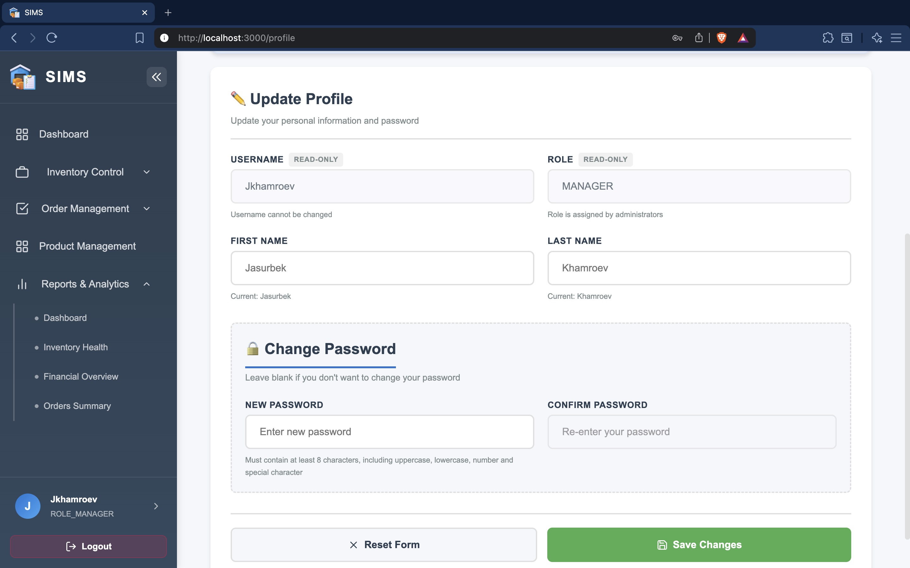
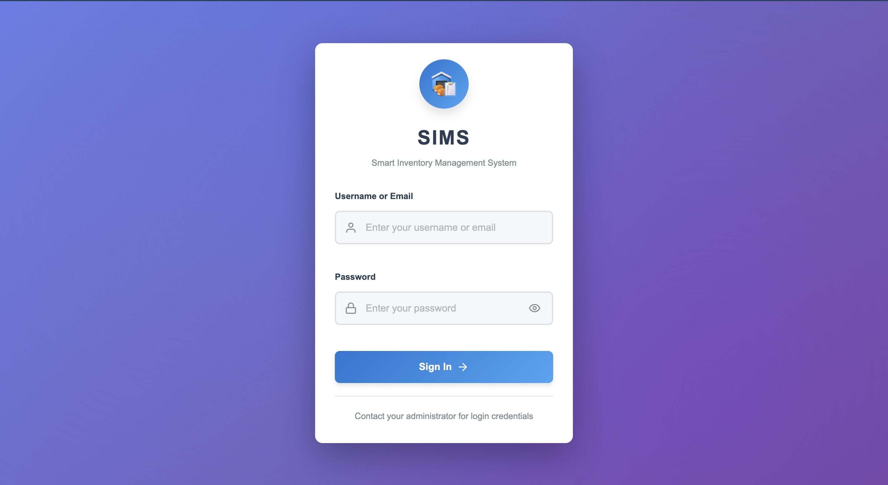

# SIMS - Smart Inventory Management System

<div align="center">


**A modern, full-stack inventory management solution built with Spring Boot Microservices and React**

[](https://www.oracle.com/java/)
[](https://spring.io/projects/spring-boot)
[](https://reactjs.org/)
[](https://www.docker.com/)
[](LICENSE)

[Features](#-features) • [Tech Stack](#-tech-stack) • [Getting Started](#-getting-started) • [Screenshots](#-screenshots) • [API Documentation](#-api-documentation)

</div>

## 🎯 About The Project

**SIMS (Smart Inventory Management System)** is a comprehensive enterprise-grade solution designed to streamline inventory operations for retail and warehouse businesses. Built with modern microservices architecture, it provides real-time inventory tracking, intelligent stock alerts, order management, and powerful analytics.

### Why SIMS?

- ✅ **Real-time Inventory Tracking** - Monitor stock levels across multiple locations
- ✅ **Intelligent Alerts** - Automated low-stock notifications via email
- ✅ **QR Code Integration** - Quick order tracking and verification
- ✅ **Role-based Access Control** - Secure multi-user management
- ✅ **Comprehensive Analytics** - Data-driven insights and reports
- ✅ **Cloud-ready** - Fully containerized with Docker

---

## ✨ Features

### 📦 Inventory Management
- **Total Items Overview** - Complete inventory dashboard with real-time statistics
- **Stock Level Monitoring** - Track current stock, minimum levels, and available quantities
- **Low Stock Alerts** - Automated notifications when items reach minimum thresholds
- **Damage & Loss Tracking** - Record and monitor inventory discrepancies
- **Incoming/Outgoing Stock** - Manage stock movements and transactions

### 🛒 Order Management
- **Purchase Orders** - Create and manage supplier orders
- **Sales Orders** - Process customer orders with inventory deduction
- **QR Code Tracking** - Generate and scan QR codes for order verification and manage the Order Statusses manually

### 📊 Product Management
- **Product CRUD Operations** - Add, edit, delete products with validation
- **Category Management** - Organize products into categories
- **Location Tracking** - Warehouse location management (e.g. A1-123)
- **Price Management** - Update product pricing
- **Status Control** - Active, On Order, Planning, Discontinued, Archived, Restricted

### 📈 Reports & Analytics
- **Analytics Dashboard** - Comprehensive business metrics and KPIs
- **Inventory Health Reports** - Stock turnover, aging, and optimization
- **Financial Overview** - Revenue, cost, and profit analysis
- **Orders Summary** - Order trends and performance metrics
- **Excel Export** - Download detailed reports for offline analysis

### 👤 User Management
- **Role-based Access** - Admin, Manager, and User roles
- **Secure Authentication** - JWT-based authentication with refresh tokens
- **User Profile Management** - Update personal information and passwords
- **Session Management** - Multiple device support with logout capabilities

### 🔔 Smart Notifications
- **Low Stock Alerts** - Email notifications when inventory falls below minimum levels
- **Customizable Thresholds** - Set minimum stock levels per product
- **Multi-recipient Support** - Send alerts to multiple stakeholders

---

## 🛠 Tech Stack

### Backend
- **Java 21** - Modern Java features and performance
- **Spring Boot 3.4.4** - Microservices framework
- **Spring Cloud** - Service discovery and API gateway
  - Eureka Server - Service registry
  - Spring Cloud Gateway - API routing and filtering
- **Spring Data JPA** - Database abstraction
- **Spring Security** - Authentication and authorization
- **JWT** - Stateless authentication
- **MySQL 8.0** - Relational database
- **JavaMail** - Email notifications
- **AWS S3** - QR code image storage
- **Apache POI** - Excel report generation
- **Google ZXing** - QR Code generation
- **Maven** - Dependency management

### Frontend
- **React 18.2.0** - UI library
- **Vite** - Build tool and dev server
- **React Router v6** - Client-side routing
- **Axios** - HTTP client
- **CSS Modules** - Component-scoped styling

### DevOps
- **Docker** - Containerization
- **Docker Compose** - Multi-container orchestration
- **Nginx** - Reverse proxy and static file serving
- **Git** - Version control

---

### Microservices Overview

| Service | Port | Description |
|---------|------|-------------|
| **Frontend** | 3000 | React application served by Nginx |
| **API Gateway** | 8080 | Routes requests to microservices |
| **Eureka Server** | 8761 | Service discovery and registration |
| **Auth Service** | 8081 | Authentication, user management |
| **Core Service** | 8083 | Inventory, products, orders, analytics |
| **MySQL** | 3307 | Database (mapped to avoid conflicts) |

---

## 🚀 Getting Started

### Clone the Repository

```bash
git clone https://github.com/LastCoderBoy/SIMS-Microservice.git
cd SIMS-Microservice
```
----------------------------
### 🐳 Docker Deployment
1. Configure Environment
Create .env file in the root directory:

```bash
# Database
MYSQL_ROOT_PASSWORD=Mysql_2003
MYSQL_USER=Guest_Credentials
MYSQL_PASSWORD=Mysql_2003

# JWT
JWT_SECRET=W5f2wJ5EqMi828ug2JDVXzjy8BcoPFBmH3fiLAINDFU=

# Email (Gmail)
MAIL_USERNAME=your_email@gmail.com
MAIL_PASSWORD=your_app_password
MAIL_ALERT_USERNAME=alert_email@gmail.com

# AWS S3 (for QR codes)
AWS_ACCESS_KEY=your_access_key
AWS_SECRET_KEY=your_secret_key
AWS_REGION=eu-central-1
AWS_S3_BUCKET=your_bucket_name

# Frontend
VITE_API_URL=/api/v1
```
----------------------------
### 2 Build and Run

``` bash
# Build all services
docker-compose build

# Start all services
docker-compose up -d

# View logs
docker-compose logs -f

# Check status
docker-compose ps
```

## Access the Application
Frontend: http://localhost:3000
API Gateway: http://localhost:8080
Eureka Dashboard: http://localhost:8761

## Stop Services
```bash
# Stop all services
docker-compose down

# Stop and remove volumes
docker-compose down -v
```
__________________________________________
# 📸 Screenshots

Dashboard
 Main dashboard with inventory statistics and alerts

Total Items - Inventory Overview
 Complete inventory list with search, filter, and pagination

Low Stock Alerts
 Products below minimum stock levels with alert badges

Product Management
 Add, edit, delete products with category and status management

Purchase Orders
 Create and manage supplier purchase orders

Sales Orders
 Process customer sales orders with QR code generation

QR Order Tracker
 Scan and verify orders using QR codes

Analytics Dashboard
 Business intelligence and performance metrics

User Profile
 Manage personal information and security settings

Login Page
 Secure authentication with JWT tokens


## 🤝 Contributing
Contributions are welcome! Please follow these steps:

1. Fork the Project

2. Create your Feature Branch
``` bash
git checkout -b feature/AmazingFeature
```
3. Commit your Changes
``` bash
git commit -m 'Add some AmazingFeature'
```
4. Push to the Branch
```bash
git push origin feature/AmazingFeature
```
5. Open a Pull Request

### Coding Standards
* Follow Java code conventions
* Use ESLint and Prettier for JavaScript/React
* Write meaningful commit messages
* Add unit tests for new features
* Update documentation

## 📄 License
Distributed under the MIT License. See LICENSE for more information.

👤 Contact
Jasurbek Khamroev

GitHub: @LastCoderBoy

Project Link: [SIMS](https://github.com/LastCoderBoy/SIMS-Microservice.git)
